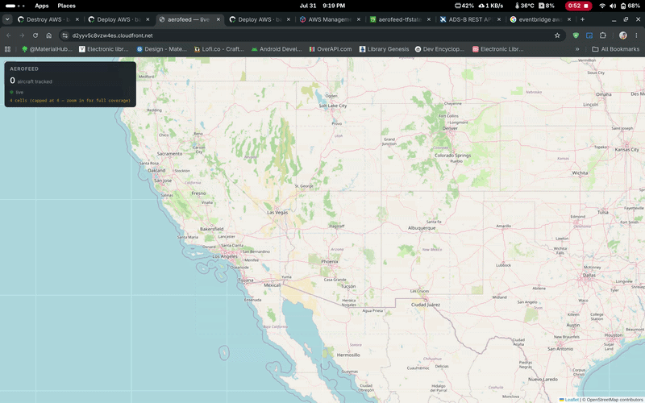
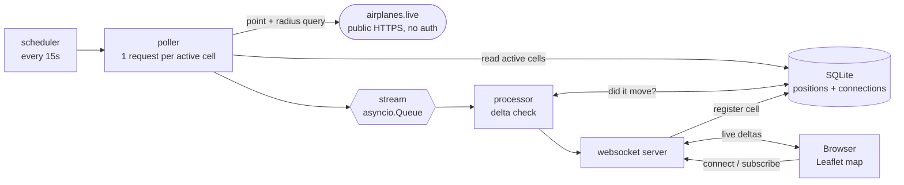

# Aerofeed

Live aircraft positions, streamed to a browser map over WebSockets. A poller
fans out one upstream request per *region cell* rather than per client, so a
thousand subscribers watching the same sky cost exactly one API call; positions
flow through a stream into a store, and only the deltas — an aircraft that
actually moved — are pushed to connected clients.

**This branch is the local pipeline**: SQLite, an `asyncio.Queue` and a plain
`websockets` server, running as one process with no cloud account and no
credentials. That is not a mock of the real thing — it is the same domain code.
`core/` sees only the protocols in `core/storage_interface.py`, so swapping in
managed services is a handful of constructor substitutions at one wiring line.

> **Looking for the AWS deployment?** It lives on the
> [`cloud/aws`](../../tree/cloud/aws) branch — Lambda, API Gateway WebSockets,
> Kinesis, DynamoDB, EventBridge, Terraform, and GitHub Actions with OIDC, plus
> a full architecture write-up, design-decision rationale and cost breakdown in
> its README. This branch is kept separate as the dependency-free core.

---



The same frontend and the same `core/` logic, recorded against the deployed AWS
stack on the [`cloud/aws`](../../tree/cloud/aws) branch. The counter climbing
from 0 to 589 is the polling cycle starting cold: that deployment keeps its
schedule disabled while nobody is connected, so the first client to arrive pays
a one-off wait to fill the map. Locally there is no such ramp — the scheduler
runs every 15s from process start.

---

## Run it

No account, no credentials, no configuration — every setting has a working
default.

```bash
git clone https://github.com/barathsuresh/aerofeed.git
cd aerofeed
python -m venv .venv && source .venv/bin/activate
pip install -r requirements.txt

python run_local.py
```

Then open `frontend/index.html`, or connect a client directly:

```bash
websocat 'ws://127.0.0.1:8765/?lat=51.5&lon=-0.1'
```

Real output — the client is snapped to a grid cell, then receives aircraft as
the poller pulls them:

```
websocket listening on ws://127.0.0.1:8765
connect f64ed8e0 from 127.0.0.1 -> cell 50_-5 (query override, 51.500/-0.100)
polled cell 50_-5 -> 50 states
```

```jsonc
{"type": "subscribed", "region_cell": "50_-5", "bbox": [50.0, -5.0, 55.0, 0.0]}
{"type": "aircraft", "region_cell": "50_-5",
 "state": {"icao24": "40683e", "callsign": "VIR92MC", "longitude": -7.15195, ...}}
```

```bash
python -m pytest        # 139 tests, ~1s, no network
```

> If startup fails with `sqlite3.OperationalError: no such column`, you have a
> `local.db` from an older schema. Delete it; it is regenerated.

`.env.example` documents the overrides (`AEROFEED_GRID_SIZE`,
`AEROFEED_POLL_INTERVAL`, `AEROFEED_DEFAULT_LAT/LON`). There are no credentials
to fill in — airplanes.live needs none.

---

## How it works



Each stage is swapped for a managed service on the `cloud/aws` branch — the
queue becomes Kinesis, SQLite becomes DynamoDB, the server becomes an API
Gateway WebSocket API — without `core/` changing at all.

### Region-cell bucketing, and its tradeoff

Clients are snapped onto a fixed 5° grid (`core/geo.py`), cells named by their
south-west corner: `(51.5, -0.1)` → `"50_-5"`. The poller reads *distinct*
active cells and issues one upstream request each, so polling cost scales with
**area being watched**, not with subscriber count.

**The tradeoff, stated plainly:** snapping is a hard partition. Two clients a
hundred metres apart across a cell boundary land in different cells, and each
sees only its own side — aircraft just over the line are real but never
delivered. Fixing it needs neighbour fan-out or per-client bounding boxes, both
of which multiply upstream calls against a provider that allows 1 request per
second. It is pinned by `tests/test_geo.py` so it stays a known property rather
than drifting into a bug.

Cells are circumscribed rather than inscribed when converted to the provider's
point+radius query — over-covering means occasionally seeing an aircraft just
outside the box, under-covering means a corner of the map is silently always
empty. Silent holes are worse than harmless extras.

### The upstream rate limit shapes everything

airplanes.live allows **1 request/second**. The poller paces calls **1.1s**
apart (`local/poller.py`) — the extra 0.1s absorbs scheduling jitter, since
pacing exactly at the limit sits a rounding error away from a 429. The limit
lives in the poller, not the client: `AirplanesLiveClient.get_states()` makes
exactly one call and never sleeps, so whoever loops over cells owns the pacing.

A cycle over N cells therefore takes at least `(N-1) × 1.1s`, which must stay
well under the poll interval or ticks overlap. That single constraint is why
polling is per-cell rather than per-client, and why the cell cap exists at all.

---

## Layout

```
core/          Domain logic. No cloud SDK, no framework. Pure functions + protocols.
  geo.py         grid snapping, viewport -> cells, cell -> point+radius
  delta.py       "did this aircraft actually move?"
  subscription.py, models.py, storage_interface.py
local/         Backends: SQLite store, asyncio.Queue stream, websockets server
frontend/      Leaflet map
tests/         139 tests, no network
```

The layering is the point. `core/` takes its settings as arguments and knows
nothing about where they come from; `config.py` is the one place that reads the
environment, which keeps the domain logic testable with literal values and the
whole suite runnable offline in about a second.
