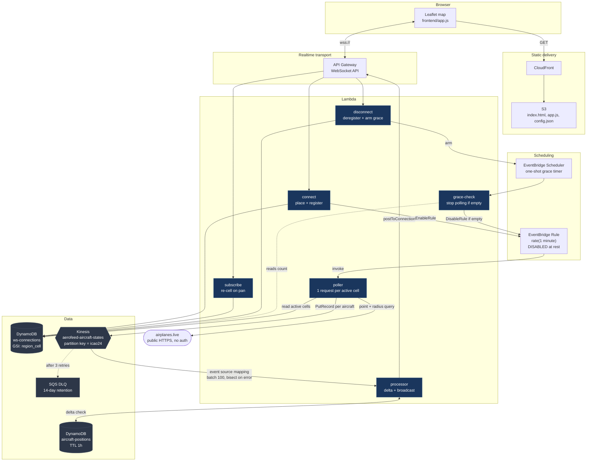
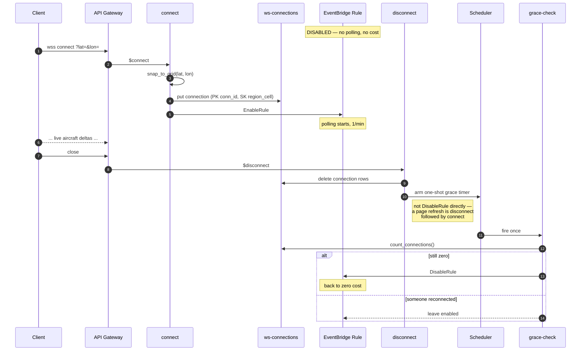

# Aerofeed

Live aircraft positions, streamed to a browser map over WebSockets, on a
serverless AWS pipeline that costs nothing while nobody is watching. A poller
fans out one upstream request per *region cell* rather than per client, so a
thousand subscribers over London cost exactly one API call; positions flow
through Kinesis into DynamoDB, and only the deltas — an aircraft that actually
moved — are pushed to connected clients. The whole pipeline is driven by
connection count: the first client to connect enables the polling schedule, and
a grace check disables it again once the last one leaves, which means an idle
deployment runs zero Lambdas and makes zero upstream calls. The same domain
code runs locally against SQLite, an `asyncio.Queue` and a local WebSocket
server, so the entire system is developable with `python run_local.py` and no
AWS account at all.

**Stack:** Python 3.13 · Lambda · API Gateway WebSocket · Kinesis Data Streams ·
DynamoDB · EventBridge (Rules + Scheduler) · SQS · CloudFront + S3 · CloudWatch ·
Terraform · GitHub Actions with OIDC (no long-lived AWS keys)

> **This is the `cloud/aws` branch** — the full deployed architecture. The
> [`main`](../../tree/main) branch holds the dependency-free local pipeline the
> same domain code runs against, with no cloud account required.

---

## Demo

Real output, captured from `python run_local.py` with a client subscribed over
London — the client connects, gets snapped to a grid cell, and receives
aircraft deltas as the poller pulls them:

```
20:15:20 INFO  aerofeed: websocket listening on ws://127.0.0.1:8765
20:15:24 INFO  local.local_ws_server: connect f64ed8e0 from 127.0.0.1
                                      -> cell 50_-5 (query override, 51.500/-0.100)
20:15:36 INFO  local.poller: polled cell 50_-5 -> 50 states
```

```jsonc
// first message: placement confirmation
{"type": "subscribed", "region_cell": "50_-5", "bbox": [50.0, -5.0, 55.0, 0.0],
 "cells": [{"key": "50_-5", "bbox": [50.0, -5.0, 55.0, 0.0]}]}

// then one message per aircraft that changed
{"type": "aircraft", "region_cell": "50_-5",
 "state": {"icao24": "40683e", "callsign": "VIR92MC", "longitude": -7.15195, ...}}
{"type": "aircraft", "region_cell": "50_-5",
 "state": {"icao24": "a8f00e", "callsign": "UAL962",  "longitude": -6.91369, ...}}
```

> **Screen capture pending.** The deployed stack is currently destroyed (see
> [Cost](#cost)), so there is no live URL to record against. To capture one
> after a deploy: `terraform output site_url`, open it, then record with
> [`peek`](https://github.com/phw/peek) or
> `ffmpeg -f x11grab -framerate 15 -i :0.0 -t 20 demo.gif`, and drop the result
> in `docs/demo.gif`.

---

## Architecture



### The idle-shutdown cycle

This is the part worth reading closely — it is what makes the architecture cost
nothing at rest.



---

## Why these design choices

### Kinesis over SQS — ordering per aircraft

The processor's job is a delta check: compare an incoming position against the
stored one and broadcast only if it changed. That is only correct if positions
for a given aircraft arrive **in order**. Two updates for `icao24=40683e`
processed out of order would store the older position last and then broadcast a
"movement" that runs backwards.

SQS standard is explicitly unordered; SQS FIFO gives ordering but caps at 300
messages/second per message group without batching, and every aircraft would
need its own group. Kinesis gives per-partition-key ordering natively —
`partition_key = icao24` means one aircraft's records always land on one shard
and are always read in sequence, while different aircraft spread across shards
and process in parallel. Ordering where it matters, parallelism everywhere
else.

Second reason: replay. A Kinesis record survives 24 hours and the event source
mapping checkpoints, so a processor bug can be fixed and the stream reprocessed.
A consumed SQS message is gone.

### Connection-driven EventBridge toggling — the cost argument

The poll schedule is an EventBridge Rule that Terraform creates **disabled** and
then never manages again:

```hcl
state = "DISABLED"
lifecycle {
  ignore_changes = [state]
}
```

`connect` enables it, `grace-check` disables it. The `ignore_changes` is
load-bearing: the rule's state is *runtime* state, not configuration, and
without it every `terraform apply` during a live session would disable polling
and black out connected clients.

The indirection through EventBridge Scheduler for the disable is deliberate. A
browser refresh is a disconnect immediately followed by a connect; disabling on
disconnect would cycle the rule on every refresh and leave the returning client
with no data until the next tick. So `disconnect` arms a one-shot timer, and
`grace-check` re-reads the connection count when it fires — if someone
reconnected, it does nothing. The schedule deletes itself via
`ActionAfterCompletion=DELETE`, so there is nothing to garbage-collect.

Net effect: an idle deployment invokes zero Lambdas, makes zero upstream
requests, and writes zero Kinesis records.

### Region-cell grid bucketing — and its boundary tradeoff

Clients are snapped onto a fixed 5° grid (`core/geo.py`), cells named by their
south-west corner: `(51.5, -0.1)` → `"50_-5"`. The poller reads *distinct*
active cells from the `region_cell` GSI and issues one upstream request each, so
polling cost scales with **area being watched**, not with subscriber count. A
thousand clients over London is one request per minute.

**The tradeoff, stated plainly:** snapping is a hard partition. Two clients a
hundred metres apart across a cell boundary land in different cells, and each
sees only its own side — aircraft just over the line are real but never
delivered. Fixing it needs neighbour fan-out or per-client bounding boxes, both
of which multiply upstream calls against a provider that allows 1 request per
second. The tradeoff is pinned by `tests/test_geo.py` so it stays a known
property rather than drifting into a bug.

The mitigation that *was* built: a zoomed-out viewport resolves to up to
`MAX_CELLS_PER_CLIENT` (4) cells, ordered by distance from the viewport centre,
so truncation drops the corners and what remains is always a contiguous blob
around where the user is actually looking. The cap is not arbitrary — 1 req/s
upstream over a 60s cycle is a hard ceiling of ~60 distinct cells for the entire
service, so one client claiming 4 is claiming a fifteenth of global capacity.

Cells are also circumscribed rather than inscribed when converted to the
provider's point+radius query — over-covering means occasionally seeing an
aircraft just outside the box, under-covering means a corner of the map is
silently always empty. Silent holes are worse than harmless extras.

### DLQ + partial batch failure

The processor returns `{"batchItemFailures": [...]}` and the event source
mapping is configured with `ReportBatchItemFailures`. Without that, one bad
record in a batch of 100 retries all 100.

Four settings work together:

| Setting | Value | Why |
|---|---|---|
| `bisect_batch_on_function_error` | `true` | Halve the batch on error, isolating the bad record instead of condemning its neighbours |
| `maximum_retry_attempts` | `3` | Bounded on purpose — the `-1` default stalls the shard on a poisoned record until it ages out |
| `maximum_record_age_in_seconds` | `3600` | A position older than an hour is not worth retrying; the aircraft has moved on |
| `destination_config.on_failure` | SQS DLQ | Where records go once the mapping gives up |

The Kinesis subtlety: because a stream is an ordered log, the mapping takes the
**lowest** reported sequence number and replays everything after it. So records
following a failure get delivered twice. That is safe here specifically because
reprocessing re-runs the same delta check against stored state and finds nothing
changed — idempotency by construction, not by an added dedupe table.

The DLQ holds messages for 14 days, the maximum. A DLQ message is a bug report;
it needs to survive a weekend and a holiday, not just an on-call shift.

### No VPC

Every component is an AWS-managed service on a public endpoint, and the only
outbound dependency is public HTTPS. A VPC would add a NAT Gateway (~$32/month,
more than everything else here combined) plus ~$7/month per VPC endpoint, and
lengthen cold starts, in exchange for nothing. Verified empirically: a throwaway
Lambda with no VPC config reached `api.airplanes.live` in 0.63s. Full reasoning
in [`terraform/modules/networking/README.md`](terraform/modules/networking/README.md).

---

## Cost

us-east-1 list prices, excluding always-free tiers where noted. "Idle" means
deployed with zero clients connected — the normal resting state.

| Service | Idle / month | Active | Note |
|---|---:|---|---|
| **Kinesis (on-demand)** | **≈ $29.20** | +$0.08/GB in | 730 stream-hours × $0.040. Billed whether or not anything is written |
| Lambda | $0.00 | ≈ $0.001/client-hour | 512MB; zero invocations at rest |
| DynamoDB (on-demand) | ≈ $0.00 | ≈ $0.004/client-hour | ~3k writes per client-hour; storage well under 1GB |
| API Gateway WebSocket | $0.00 | ≈ $0.002/client-hour | $1.00/M messages + $0.25/M connection-minutes |
| S3 + CloudFront | ≈ $0.00 | ≈ $0.00 | ~30KB of assets; 1TB/month CloudFront free tier |
| CloudWatch | $0.00 | $0.00 | 10 alarms (10 free), 1 dashboard (3 free) |
| SNS | $0.00 | $0.00 | First 1k email notifications free |
| **Total** | **≈ $29/month** | **≈ $0.01/client-hour** | |

Two things fall out of this table.

**The variable cost is a rounding error.** A client watching for an hour costs
about one cent. The architecture's efficiency work — cell bucketing, delta
filtering, idle shutdown — successfully drove the marginal cost to near zero.

**The standing cost is one line item.** Kinesis on-demand bills ~$0.04 per
stream-hour regardless of traffic, so an idle stream is ~$29/month and is
~99% of the resting bill. Two ways to address it:

- **Destroy when not demoing** (what this repo does — see the Destroy workflow).
  Deploy, demo, destroy: actual spend is a few dollars.
- **Switch to a provisioned single shard**, ~$0.015/shard-hour ≈ $10.95/month,
  which handles 1MB/s and 1,000 records/s — comfortably above the observed peak
  of ~150KB per poll. Edit `stream_mode` in
  [`terraform/modules/streaming/main.tf`](terraform/modules/streaming/main.tf).

---

## Setup

### Local development

No AWS account, no credentials, no configuration. SQLite stands in for DynamoDB,
an `asyncio.Queue` for Kinesis, and a local `websockets` server for API Gateway —
`core/` never learns which backend it is talking to.

```bash
git clone https://github.com/barathsuresh/aerofeed.git
cd aerofeed
python -m venv .venv && source .venv/bin/activate
pip install -r requirements.txt

python run_local.py
```

Then open `frontend/index.html` in a browser, or connect directly:

```bash
python - <<'EOF'
import asyncio, json, websockets
async def main():
    async with websockets.connect("ws://127.0.0.1:8765/?lat=51.5&lon=-0.1") as ws:
        for _ in range(5):
            print(json.loads(await ws.recv()))
asyncio.run(main())
EOF
```

Every setting has a working default; `.env.example` documents the overrides
(`AEROFEED_GRID_SIZE`, `AEROFEED_POLL_INTERVAL`, `AEROFEED_DEFAULT_LAT/LON`).
There are no credentials to fill in — airplanes.live needs none.

```bash
python -m pytest        # 299 tests, ~1s, no network
```

> If startup fails with `sqlite3.OperationalError: no such column`, you have a
> `local.db` from an older schema. Delete it; it is regenerated.

### AWS deployment

**One-time bootstrap** (local admin credentials, creates the OIDC trust and
Terraform backend — deliberately outside the main stack so it survives a
destroy):

```bash
terraform -chdir=terraform/bootstrap init
terraform -chdir=terraform/bootstrap apply \
  -var='github_owner=YOUR_GITHUB_OWNER' \
  -var='github_repo=aerofeed' \
  -var='github_owner_id=YOUR_NUMERIC_OWNER_ID' \
  -var='github_repo_id=YOUR_NUMERIC_REPO_ID' \
  -var='state_bucket_name=aerofeed-tfstate-YOUR_ACCOUNT_ID'
```

The numeric ids matter: GitHub issues ID-qualified OIDC subjects
(`repo:owner@39296391/repo@1317834859:...`) for some repositories, and the trust
policy has to match the form your repo actually sends. Both forms are trusted
when the ids are supplied. Find them with
`gh api repos/OWNER/REPO --jq '.owner.id, .id'`.

**Wire up GitHub** from the bootstrap outputs:

```bash
gh variable set AWS_DEPLOY_ROLE_ARN -b "$(terraform -chdir=terraform/bootstrap output -raw github_actions_role_arn)"
gh variable set TF_STATE_BUCKET     -b "$(terraform -chdir=terraform/bootstrap output -raw state_bucket_name)"
gh secret   set ALARM_EMAIL         -b 'you@example.com'
```

The deploy job runs in a `production` environment restricted to the `cloud/aws`
branch, which also scopes the IAM trust policy. Create it once:

```bash
gh api -X PUT repos/OWNER/REPO/environments/production \
  --input - <<< '{"deployment_branch_policy":{"protected_branches":false,"custom_branch_policies":true}}'
gh api -X POST repos/OWNER/REPO/environments/production/deployment-branch-policies -f name='cloud/aws'
```

**Deploy:**

```bash
gh workflow run "Deploy AWS" --ref cloud/aws
gh run watch
```

The workflow runs the test suite, stages per-function Lambda packages, applies
Terraform against the S3 backend with native locking, syncs the frontend to S3,
invalidates CloudFront, and publishes the site URL to the run summary and the
repository's Deployments panel. No long-lived AWS keys exist anywhere — auth is
OIDC, branch- and environment-scoped.

> Confirm the SNS subscription email after the first apply. Until the link is
> clicked the subscription sits in `PendingConfirmation` and every alarm
> notifies nobody.

**Destroy:**

```bash
gh workflow run "Destroy AWS" --ref cloud/aws
```

Tears down the whole stack, sweeps leftover `/aws/lambda/aerofeed*` log groups
Terraform does not own, and deletes the GitHub deployment records so the repo
page stops advertising a dead URL. The bootstrap stack (OIDC provider, deploy
role, state bucket) is left standing so redeploying needs no re-bootstrap; it
costs nothing idle.

---

## Layout

```
core/          Domain logic. No boto3, no framework. Pure functions + protocols.
  geo.py         grid snapping, viewport -> cells, cell -> point+radius
  delta.py       "did this aircraft actually move?"
  subscription.py, models.py, storage_interface.py
local/         Local backends: SQLite, asyncio.Queue, websockets server
aws/           AWS backends: DynamoDB stores, Kinesis stream
lambdas/       Thin handlers. Adapters onto core/ and local/ — no logic of their own.
frontend/      Leaflet map. Reads config.json at runtime; no hardcoded endpoint.
terraform/     Root module + 7 child modules; bootstrap/ is applied separately
tests/         299 tests, no network, no AWS
```

The layering is the point: `lambdas/poller_handler.py` is ~30 lines because all
the behaviour lives in `local/poller.py`, which is the same code the local
pipeline runs. Swapping DynamoDB for SQLite is three constructor substitutions,
because `core/` only ever sees the protocols in `core/storage_interface.py`.

## Known gaps

Deliberate, and documented rather than hidden:

- **Cell boundary partitioning** — clients near an edge see one side only. See
  the tradeoff discussion above.
- **`list_active_cells()` scans the GSI** and dedupes client-side. DynamoDB has
  no `DISTINCT`; the alternative is an aggregate item updated on every
  connect/disconnect — a write amplifier to avoid scanning a table sized by
  "currently connected clients".
- **`publish()` is one `PutRecord` per aircraft.** `PutRecords` batches 500 and
  is the obvious next step; it needs per-record partial-failure handling.
- **Lambda log groups have no retention policy**, so logs accumulate at
  $0.50/GB-month ingested. Low volume, but unbounded.
- **GeoIP is an external HTTP call** in the connect path, costing a 2s timeout
  on provider failure. A MaxMind GeoLite2 layer would make it local and
  sub-millisecond, at the cost of a licence key and a build step.
